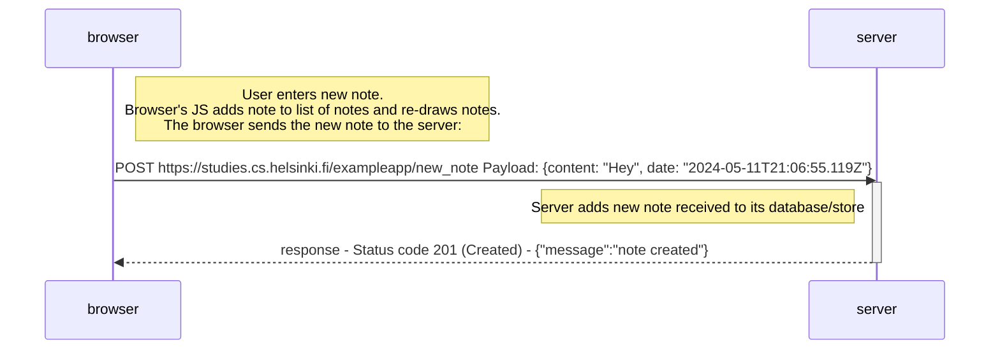

:

```mermaid
sequenceDiagram
    participant browser
    participant server

    Note right of browser: User enters new note.<br> Browser's JS adds note to list of notes and re-draws notes.<br> The browser sends the new note to the server:

    browser->>server: POST https://studies.cs.helsinki.fi/exampleapp/new_note Payload:  {content: "Hey", date: "2024-05-11T21:06:55.119Z"}
    activate server

    Note left of server: Server adds new note received to its database/store

    server-->>browser: response - Status code 201 (Created) - {"message":"note created"}
    deactivate server

```
